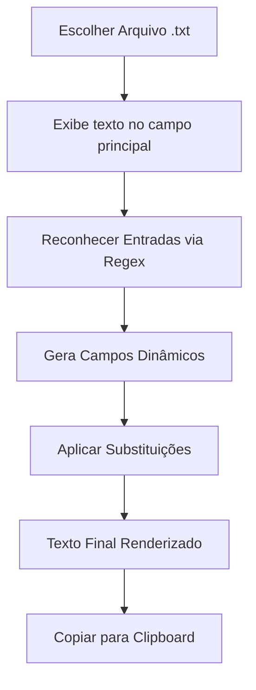

# ✨ Editor de Prompts (Tkinter)

## 🎯 Descrição Rápida
O **Editor de Prompts** é um aplicativo desktop simples, criado em Python com Tkinter, que permite carregar arquivos `.txt`, identificar automaticamente variáveis entre `{chaves}`, gerar campos de preenchimento dinâmicos e, com um clique, substituir os valores no texto final — pronto para copiar e usar em qualquer fluxo de trabalho.

Este projeto foi desenvolvido como um experimento de **desenvolvimento assistido por IA**, explorando como modelos de IA podem ajudar desde a concepção, correção de bugs e melhorias iterativas até o refinamento final.

## 🌱 Contexto do Projeto
Este projeto nasceu durante um chat de construção iterativa com IA, onde a ideia era criar um aplicativo que facilitasse a edição rápida de prompts reutilizáveis. A cada iteração, foram exploradas soluções técnicas, ajustes no design, melhorias no clipboard (com e sem bibliotecas externas) e refinamento da experiência do usuário.

Ele pertence ao laboratório *AI-Assisted Dev Lab*, onde projetos são documentados em detalhes para fins educativos e comunidade.

## 🧩 Funcionalidades
- Carrega arquivos `.txt` com prompts contendo variáveis.
- Identifica automaticamente variáveis entre `{}` usando regex.
- Gera campos de entrada dinâmicos para cada variável única.
- Substitui os valores no texto com apenas um clique.
- Copia o texto final para a área de transferência (com fallback multiplataforma).
- Botão para “Instalar pyperclip” (opcional, para clipboard mais robusto).
- Botão para limpar o texto carregado.
- Não altera o arquivo original.
- Interface simples, em uma única tela.

## 🏗️ Arquitetura / Fluxo do Projeto



Processo interno:
1. Carrega o arquivo com encoding UTF-8.  
2. Extrai variáveis com `re.findall(r"\{([^}]+)\}", texto)`.  
3. Remove duplicatas e cria campos dinamicamente.  
4. Monta o texto final com `re.sub`.  
5. Copia via:
   - `pyperclip`
   - OU fallback por SO (`clip`, `pbcopy`, `xclip/xsel`).  

## 🧠 Tecnologias Utilizadas
- **Linguagem:** Python 3.x  
- **Bibliotecas padrão:** Tkinter, re, subprocess  
- **Biblioteca opcional:** pyperclip (clipboard)  
- **Ferramentas de IA:** modelo utilizado no chat para criação + iteração  
- **Modelos de IA usados:** não especificado no PDF, mas foi utilizado IA para debugging e melhorias  

## ▶️ Como Executar

1. Clone o repositório:
```bash
git clone <url-do-repo>
```

2. Instale dependências opcionais (somente se quiser clipboard avançado):
```bash
pip install pyperclip
```

3. Execute o arquivo principal:
```bash
python editor_prompts.py
```

4. Use a interface para:
   - **Escolher arquivo**
   - **Reconhecer entradas**
   - Preencher variáveis
   - **Aplicar**
   - **Copiar**

Não é necessário nenhum arquivo adicional além de um `.txt`.

## 🤖 Prompts Utilizados
Durante o desenvolvimento, foram explorados prompts do tipo:

- Prompt inicial pedindo a criação do app Tkinter.
- Prompts de refatoração para melhorar a UI.
- Prompts de debugging para corrigir substituições e clipboard.
- Prompts para adicionar fallback multiplataforma.
- Prompts para melhorar organização, legibilidade e robustez do código.

*(Sugestão: coloque estes arquivos na pasta `/prompts` do projeto para aprendizado público.)*

## 🔁 Processo Assistido por IA (Iterações)
- A IA sugeriu a estrutura inicial do aplicativo.
- Refinou o uso de regex para capturar variáveis.
- Corrigiu comportamentos duplicados no reconhecimento.
- Melhorou a lógica do clipboard, oferecendo duas versões:
  - Com pyperclip
  - Sem dependências externas (fallback SO)
- Ajustou a organização da UI para maior usabilidade.
- Orientou sobre como evitar múltiplos inputs para variáveis repetidas.
- Implementou mensagens de status amigáveis.

## 📸 Demonstrações e Resultados
*(Inclua aqui prints do aplicativo rodando — especialmente antes/depois da substituição.)*

Sugestão de conteúdo:
- Interface após carregar o arquivo.
- Campos dinâmicos gerados.
- Texto final aplicado.
- Demonstração da cópia para clipboard.

## 🚧 Limitações Atuais
- Não possui sistema de temas ou personalização de layout.
- Depende da qualidade do arquivo `.txt` para gerar variáveis corretamente.
- Não valida formatos de variáveis além do padrão `{}`.
- Funcionalidades extras como exportação ainda não foram implementadas.

## 🧭 Próximos Passos / Roadmap
- [ ] Adicionar suporte a salvar o texto final em um arquivo.
- [ ] Criar pré-visualização em outra janela.
- [ ] Suporte a múltiplos templates carregados simultaneamente.
- [ ] Detecção de variáveis com padrões customizados.
- [ ] Embalar como executável (.exe / .app / .AppImage).
- [ ] Criar versão web com Flask/Streamlit.

## 💡 Insights e Aprendizados
- Regex é extremamente eficaz para esse tipo de extração simples.
- Tkinter é suficiente para MVPs leves e didáticos.
- Soluções sem dependências externas aumentam portabilidade.
- Desenvolver iterando com IA acelera refinamento e debugging.
- Documentar o processo (como feito neste README) é crucial para aprendizado público.

## 🤝 Contribuições
Sinta-se à vontade para abrir issues, sugerir melhorias ou enviar PRs — especialmente para novas funcionalidades, refinamento de UI e organização da pasta de prompts.

## 📄 Licença
MIT — uso livre para estudos, projetos e extensões.

## 📬 Feedback da Comunidade (Opcional)
Se usar este projeto em seus próprios fluxos de trabalho ou o adaptar de alguma forma, compartilhe no LinkedIn ou abra uma issue contando sua experiência.
