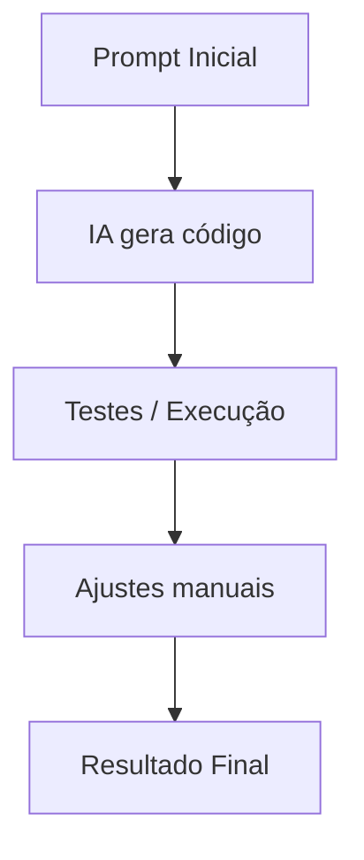

# ✨ Nome do Projeto

## 🎯 Descrição Rápida
Escreva aqui uma explicação curta e direta (2–4 frases) sobre:
- Qual problema este projeto resolve  
- Como ele funciona  
- Qual foi o objetivo do experimento  
- Qual o papel da IA na criação  

---

## 🌱 Contexto do Projeto  
Explique em que situação ou motivação o projeto nasceu.  
Exemplos:
- “Faz parte da minha série explorando IA aplicada a automações.”  
- “Este projeto é um estudo sobre como modelos transformacionais lidam com X.”  
- “Tentei desenvolver isso usando apenas IA, gerando todas as iterações via prompt.”  

---

## 🧩 Funcionalidades  
Liste aqui as funcionalidades principais:  
- Funcionalidade 1  
- Funcionalidade 2  
- Funcionalidade 3  

Se houver funcionalidades planejadas, inclua também.

---

## 🏗️ Arquitetura / Fluxo do Projeto  
Inclua um diagrama simples (Mermaid opcional) ou explique o fluxo geral:

Exemplo:

- Prompt inicial → IA gera estrutura → testes → ajustes → versão final  
- Script principal → módulo auxiliar → integração com API  
- Backend → controller → serviço → modelo  

Opcional (exemplo em Mermaid):



---

## 🧠 Tecnologias Utilizadas  
Liste as tecnologias essenciais:

- Linguagens  
- Bibliotecas  
- Frameworks  
- Ferramentas de IA  
- Modelos de IA usados (e versões)  

---

## ▶️ Como Executar  
Passo a passo simples e direto:

1. Clone o repositório  
2. Instale dependências  
3. Configure variáveis de ambiente (se houver)  
4. Rode o comando principal  

Exemplo:

```bash
git clone https://github.com/usuario/repositorio.git
cd repositorio
npm install
npm run dev
```

---

## 🤖 Prompts Utilizados  
Inclua aqui todos os prompts usados no processo:

- Prompt inicial  
- Prompts de iteração  
- Prompts de debugging  
- Prompts usados para documentação  

Sugestão: colocar cada prompt em arquivos separados dentro de `/prompts`.

---

## 🔁 Processo Assistido por IA (Iterações)  
Explique como a IA participou:

- Como o projeto começou  
- Quais partes funcionaram bem de primeira  
- Onde a IA errou ou insistiu em respostas ruins  
- Onde você precisou intervir manualmente  
- O que foi mais surpreendente  

Conte essa seção como um mini diário de bordo.

---

## 📸 Demonstrações e Resultados  
Inclua:
- Prints de tela  
- GIF de execução  
- Comparação entre versões geradas  
- Descrição de resultados  

---

## 🚧 Limitações Atuais  
Seja transparente (isso gera muito valor educacional):

- Pontos onde a IA teve dificuldade  
- Partes não implementadas  
- Comportamentos inesperados  
- Bugs conhecidos  
- Restrições técnicas  

---

## 🧭 Próximos Passos / Roadmap  
Liste evoluções planejadas:

- Melhorias  
- Refatorações  
- Novos recursos  
- Expansões do experimento  
- Próximos estudos com IA  

---

## 💡 Insights e Aprendizados  
Explique o que você aprendeu com este projeto:

- Sobre a tecnologia  
- Sobre prompting  
- Sobre arquitetura  
- Sobre limites e capacidades da IA  
- Sobre o processo de desenvolvimento assistido  

Essa é uma das seções mais valiosas para quem está aprendendo com seus projetos.

---

## 🤝 Contribuições  
Indique como outras pessoas podem:
- Abrir issues  
- Criar PRs  
- Sugerir ideias  
- Reportar problemas  
- Compartilhar insights de prompting  

Se quiser, inclua regras do repositório ou links para `CONTRIBUTING.md`.

---

## 📄 Licença  
Indique a licença usada neste projeto.

Exemplo:

> Este projeto está licenciado sob a Licença MIT. Consulte o arquivo LICENSE para mais detalhes.

---

## 📬 Feedback da Comunidade (Opcional)  
Espaço para incluir:

- Comentários de usuários  
- Sugestões importantes recebidas  
- PRs relevantes  
- Insights da comunidade que mudaram o projeto  

